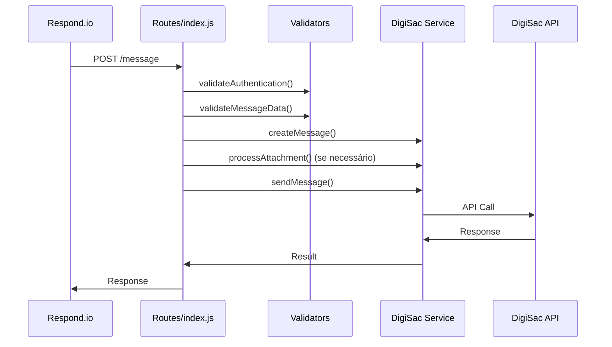
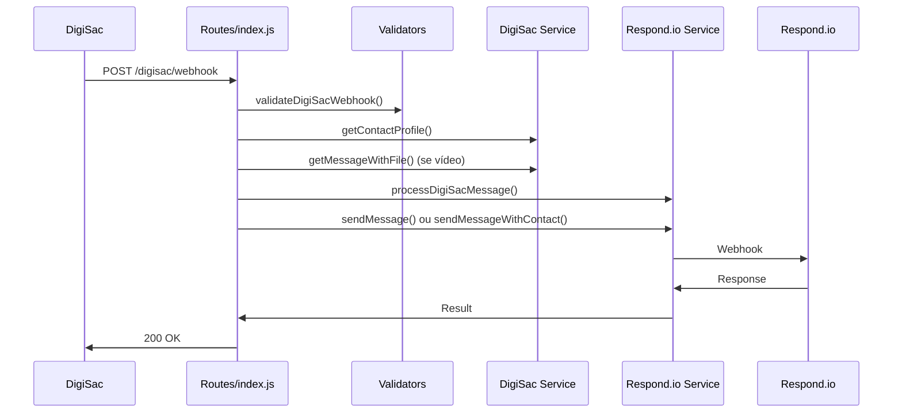

# Arquitetura do Projeto - Custom Channel Integration

## 📋 Visão Geral

Este documento descreve a arquitetura modular do servidor de integração entre **DigiSac** e **respond.io**, após a reorganização completa do código.

## 🏗️ Arquitetura Modular

### Estrutura de Diretórios

```
custom-channel-integration-respond-digisac/
├── server.js                    # 🚀 Ponto de entrada da aplicação
├── routes/
│   └── index.js                 # 🛣️ Rotas da API REST
├── services/                    # 🔌 Serviços de integração
│   ├── digisac.js              # 📱 API DigiSac
│   ├── respond.js              # 💬 API Respond.io
│   └── refera.js               # 🔗 API Refera
├── utils/                       # 🛠️ Utilitários reutilizáveis
│   ├── logger.js               # 📝 Sistema de logs
│   ├── formatters.js           # 🔄 Formatação de dados
│   └── validators.js           # ✅ Validações
├── package.json                 # 📦 Dependências
├── docker-compose.yml           # 🐳 Configuração Docker
└── README.md                    # 📚 Documentação principal
```

## 🔌 Camada de Serviços

### 📱 DigiSac Service (`services/digisac.js`)

**Responsabilidades:**
- Integração com a API DigiSac
- Envio de mensagens
- Consulta de status
- Processamento de arquivos
- Gerenciamento de contatos

**Classes Principais:**
- `DigiSacMessage`: Representa uma mensagem DigiSac
- `DigiSacMessageCollection`: Coleção de mensagens
- `DigiSacApiService`: Cliente da API DigiSac

**Métodos Principais:**
```javascript
// Envio de mensagens
await digiSacApiService.sendMessage(message)

// Consulta de status
await digiSacApiService.getMessageStatus(messageId)

// Processamento de arquivos
digiSacApiService.processDigiSacFile(messageData, phoneNumber)

// Criação de mensagens
digiSacApiService.createMessage(phoneNumber, messageData, serviceId, userId)
```

### 💬 Respond.io Service (`services/respond.js`)

**Responsabilidades:**
- Integração com a API Respond.io
- Envio de webhooks
- Processamento de Messaging Echoes
- Validação de autenticação

**Métodos Principais:**
```javascript
// Envio de mensagens
await respondIoApiService.sendMessage(messageData, messageId, contactPhoneNumber, timestamp, isFromMe)

// Envio com dados de contato
await respondIoApiService.sendMessageWithContact(messageData, messageId, contactPhoneNumber, timestamp, contactData)

// Validação de autenticação
respondIoApiService.validateAuthentication(req, phoneNumber)
```

### 🔗 Refera Service (`services/refera.js`)

**Responsabilidades:**
- Integração com a API Refera
- Processamento de mensagens via Refera
- Gerenciamento de credenciais

**Métodos Principais:**
```javascript
// Processamento de mensagens
await referaApiService.processMessage(channelID, messageData)

// Verificação de configuração
referaApiService.isConfigured()
```

## 🛠️ Camada de Utilitários

### 📝 Logger (`utils/logger.js`)

**Responsabilidades:**
- Sistema de logs centralizado
- Logs condicionais baseados em sandbox mode
- Diferentes níveis de log

**Funções Principais:**
```javascript
// Logs condicionais (só para números autorizados em sandbox)
conditionalLog(phoneNumber, message, data)

// Logs sempre visíveis
alwaysLog(message, data)

// Logs de erro
errorLog(message, error)

// Logs de debug
debugLog(phoneNumber, message, data)

// Logs de API
apiLog(message, data)
```

### 🔄 Formatters (`utils/formatters.js`)

**Responsabilidades:**
- Formatação de dados para diferentes APIs
- Formatação de respostas padronizadas
- Conversão de tipos de dados

**Funções Principais:**
```javascript
// Formatação de números brasileiros
formatBrazilianPhoneNumber(phoneNumber)

// Formatação de timestamps
formatTimestamp(timestamp)

// Formatação de dados para Respond.io
formatMessageForRespondIo(messageData, messageId, contactPhoneNumber, timestamp, isFromMe)

// Formatação de respostas de erro
formatErrorResponse(message, details, status)

// Formatação de respostas de sucesso
formatSuccessResponse(data, message)
```

### ✅ Validators (`utils/validators.js`)

**Responsabilidades:**
- Validação de dados de entrada
- Validação de autenticação
- Validação de formatos

**Funções Principais:**
```javascript
// Validação de números brasileiros
isValidBrazilianPhone(phoneNumber)

// Validação de autenticação
validateAuthentication(req, expectedToken, phoneNumber)

// Validação de dados de mensagem
validateMessageData(phoneNumber, messageData)

// Validação de anexos
validateAttachment(attachment)

// Validação de webhooks
validateDigiSacWebhook(webhookData)
```

## 🛣️ Camada de Rotas

### Rotas Principais (`routes/index.js`)

**Responsabilidades:**
- Definição dos endpoints da API
- Orquestração entre serviços
- Tratamento de requisições HTTP

**Endpoints Principais:**
```javascript
// Envio de mensagens
POST /message
POST /service/:serviceId/user/:userId/message

// Recebimento de webhooks
POST /digisac/webhook

// Consulta de status
GET /message/:messageId/status

// Health check
GET /health
```

## 🔄 Fluxo de Dados

### 1. Mensagem Outbound (Respond.io → DigiSac)



### 2. Mensagem Inbound (DigiSac → Respond.io)



## 🔧 Configuração e Ambiente

### Variáveis de Ambiente

```bash
# DigiSac
DIGISAC_API_URL=https://api.sac.digital/v1
DIGISAC_API_TOKEN=seu_token_digisac

# Respond.io
RESPOND_IO_TOKEN=seu_token_respond_io
RESPOND_IO_CHANNEL_ID=digisac_channel_001

# Refera (opcional)
REFERA_API_KEY=sua_api_key_refera
REFERA_API_TOKEN=seu_token_refera
REFERA_CSRF_TOKEN=seu_csrf_token_refera

# Servidor
APP_PORT=3030
NODE_ENV=development

# Sandbox
SANDBOX_MODE=true
SANDBOX_NUMBERS=5511999999999,5511888888888
```

### Modo Sandbox

O sistema possui um modo sandbox que:
- Ativa logs detalhados apenas para números específicos
- Permite desenvolvimento e debug sem poluir logs de produção
- É controlado pelas variáveis `SANDBOX_MODE` e `SANDBOX_NUMBERS`

## 🚀 Benefícios da Nova Arquitetura

### 1. **Modularidade**
- Cada módulo tem responsabilidade específica
- Fácil manutenção e extensão
- Baixo acoplamento entre componentes

### 2. **Reutilização**
- Utilitários podem ser usados em diferentes partes
- Serviços são independentes e reutilizáveis
- Padrões consistentes em todo o projeto

### 3. **Testabilidade**
- Módulos isolados facilitam testes unitários
- Dependências claras e injetáveis
- Fácil mock de serviços externos

### 4. **Manutenibilidade**
- Código organizado e legível
- Responsabilidades bem definidas
- Fácil localização de problemas

### 5. **Performance**
- Imports diretos e eficientes
- Menos overhead de dependências
- Carregamento otimizado de módulos

## 🔮 Próximos Passos

### Melhorias Planejadas

1. **Testes Unitários**
   - Testes para cada módulo
   - Mocks para APIs externas
   - Cobertura de código

2. **Monitoramento**
   - Métricas de performance
   - Logs estruturados
   - Alertas automáticos

3. **Cache e Otimização**
   - Cache de dados de contato
   - Rate limiting
   - Retry logic melhorada

4. **Documentação**
   - JSDoc para todas as funções
   - Exemplos de uso
   - Guias de troubleshooting

---

**Esta arquitetura modular torna o projeto mais robusto, manutenível e escalável.** 🎯 